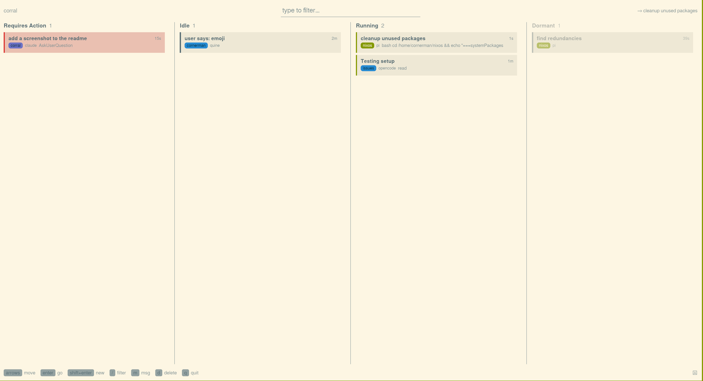
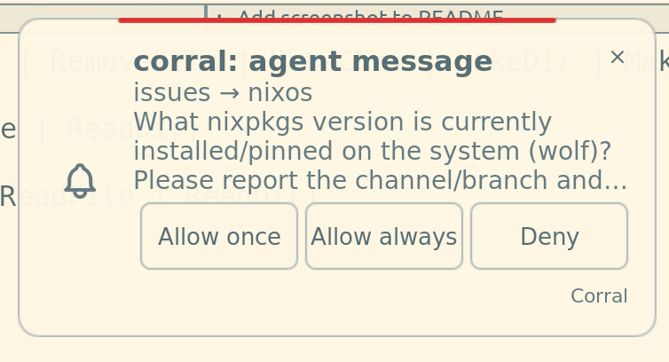
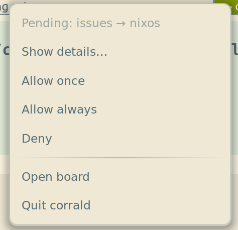

<div align="center">

<pre>
┌───────┐
│   ∴   │
└───────┘
</pre>

# corral

**An attention board for your locally running coding agents — see who needs you,
jump to them, message across agents.**

</div>

You launch agents however you already do — pi, opencode and Claude Code in your
own terminals, Cursor and other GUI agents in their own windows. Corral shows
each session as a card in one of four columns, **Requires Action / Idle /
Running / Dormant**, so you can see at a glance which agent is blocked waiting
on you, then press Enter to jump straight to its window. It never drives an
agent on its own.



## Quick Start

Install via home-manager — this is the path that gives you a working board.
It installs the binaries, runs the `corrald` messaging daemon as a user
service, and links the agent adapters:

```nix
programs.corral.enable = true;
```

Then start your agents however you normally do. They appear on the board
automatically. That is the whole loop.

A board is a pure viewer of a registry the daemon curates, so it shows nothing
on its own: it needs `corrald` running and an adapter installed in your harness,
both of which the module above sets up. From there just run `corral` (or
`corral-gui`) — launch as many boards as you like, they all reflect the same
registry.

### Binary Cache

CI pushes the package closure to a public [Cachix](https://cachix.org) cache on
every `main` build, so you substitute it instead of compiling. Add it to your
Nix config:

```nix
nix.settings = {
  substituters = [ "https://corral.cachix.org" ];
  trusted-public-keys = [ "corral.cachix.org-1:y09IX0o7GIFmfXHIQWvEsF8YWvnpe6urUdg06fXc8E4=" ];
};
```

Or, without NixOS, `cachix use corral`.

## Keys

| Key | Action |
|-----|--------|
| `Enter` | Go to the selected agent (focus its window, or resume a dormant one) |
| `Shift+Enter` | Spawn a new agent in that directory |
| `Shift+←/→` or drag | Move a card between columns to drive the agent's state (stop, continue, kill, resume) |
| `/` | Filter cards |
| `m` | Send a message to an agent |
| `o` | Fetch and open a live agent's full message history |
| `d` | Close a live agent / forget a dormant one |
| `q` | Quit |

## Messaging

Press `m` to message any agent. Agents can also message each other across
sessions via the `corral_message_agent` tool; that path goes through `corrald`,
which asks you to approve each new sender→recipient pair (Allow once / always /
Deny) on a desktop notification mirrored to the tray.

<p>
  
  
</p>

## How It Works

For the curious and for contributors. Agents self-announce through a filesystem
convention; the boards are pure viewers that reflect it; a daemon brokers
cross-agent messages. No process drives an agent on its own.

- **Agents announce.** Each session writes a record to
  `<cwd>/.corral/registry/<id>.json`, binds a workdir-local ACP socket
  `<cwd>/.corral/<label>-<pid>.sock`, and drops a per-session pointer at
  `~/.corral/input/registry/<id>`. A tiny per-harness adapter does this (see
  `extensions/`); the core is agent-agnostic and speaks the
  [CONVENTION.md](CONVENTION.md) contract, not any one harness.
- **Boards reflect.** `corral` (TUI) and `corral-gui` (desktop) read the vetted
  registry, watch each live socket for state (running / idle / requires_action,
  activity, title), and render the four columns. Pure viewers, launch as many as
  you like; `--launcher` opens either as an ephemeral popup.
- **The daemon routes.** `corrald` is a headless singleton: it curates the
  untrusted registry into a sealed vetted store the boards read, and brokers
  gated cross-agent messages. The boards never talk to it.

Everything shared lives in `corral-core`; the three binaries differ only in
shell (ratatui / iced / headless).

## Repo Layout

| Path | What |
|------|------|
| `crates/core` | `corral-core` — shared, UI-free logic: registry discovery, the reflect engine, the focus / launch / prompt seams. |
| `crates/board` | `corral` — the TUI attention board (ratatui). |
| `crates/gui` | `corral-gui` — the same board as a desktop window (iced). |
| `crates/daemon` | `corrald` — the messaging daemon (control socket, whitelist gate, approval tray). |
| `extensions/` | per-harness adapters: pi, opencode, Claude Code, Cursor. |

Dev loop: `nix develop` then `just test` / `just lint` / `just board` / `just
gui` / `just daemon`. Architecture depth is in [AGENTS.md](AGENTS.md).

## Sandbox Setup

If you sandbox your agents (recommended; see Security below), the sandbox
profile needs exactly one write exception: `$HOME/.corral/input`. Everything
else under `~/.corral` (the sealed vetted registry, the whitelist, the audit
log) must stay denied — an agent's own workdir already carries the write access
it needs for its own `.corral/` registry and socket. Example, in whatever
profile syntax your sandbox uses:

```
allow write:   $HOME/.corral/input
```

Also add `.corral/` to your global gitignore: every project directory an agent
touches gains one (the registry record and the session socket), and none of it
belongs in a commit. `programs.corral.gitignore.enable` (default `true`) does
this for you automatically when `programs.git.enable` is also on; if it is
not, home-manager warns on every rebuild instead of silently doing nothing.
Add `.corral/` to your own `core.excludesfile` by hand and set

```nix
programs.corral.gitignore.enable = false;
```

to silence that warning once you have.

## Security: the Filesystem Is the Authority

No ports, no network — every channel is a `0700` unix socket or file under
`~/.corral` and each workdir's `.corral/`. The one credential is directory
permissions, and the one idea is **physical location is identity**: a sandboxed
agent can write only inside its own workdir, so `corrald` derives who wrote a
record from *where it lives*, never from what it claims. From that, corrald
curates untrusted records into a sealed vetted registry the boards read, and no
launch command runs until you approve it once. Adding corral is **risk-neutral**
— it grants an agent no privilege it did not already have. The load-bearing
precondition (a whole-process workdir sandbox), the full threat model, and the
accepted risks are in [SECURITY.md](SECURITY.md).

## Learn More

- [CONVENTION.md](CONVENTION.md) — the filesystem convention any agent joins by
  (so corral is not tied to any one harness).
- [SECURITY.md](SECURITY.md) — the threat model, mitigations, and accepted
  risks. Read it before trusting corral between mutually untrusted agents.
- [AGENTS.md](AGENTS.md) — architecture, crates, and the messaging daemon.
- [extensions/](extensions/) — the per-harness adapters (pi, opencode, Claude
  Code, Cursor).
